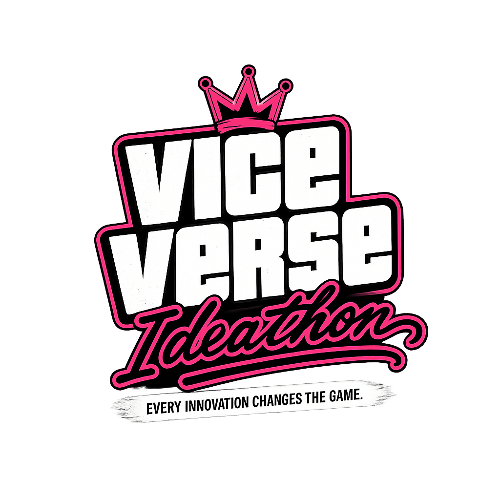
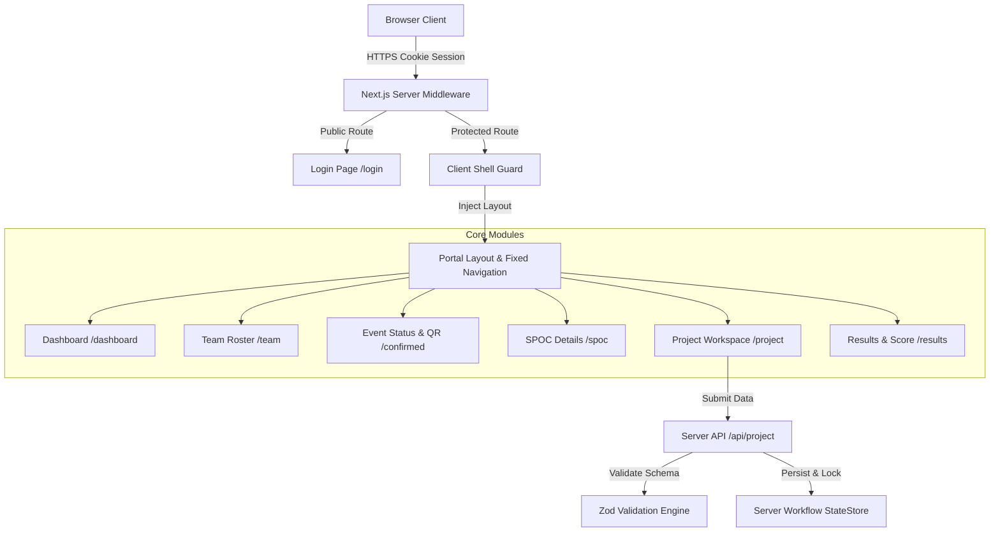
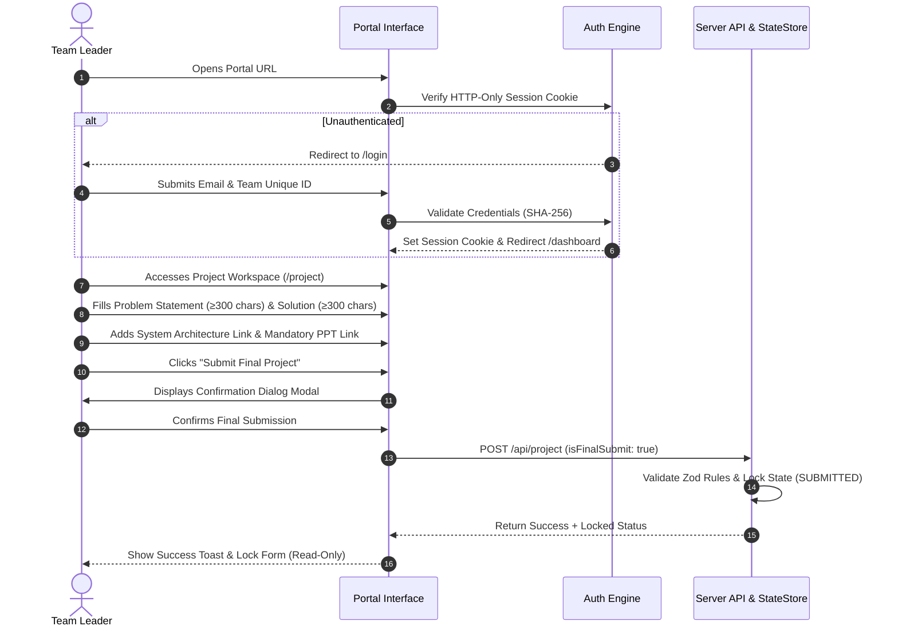

<div align="center">

  

  # VICEVERSE // TEAM LEADER PORTAL
  ***One team. One mission. One command center.***

  <p align="center">
    
    
    
    
    
  </p>

</div>

---

### ⚡ Project at a Glance

| Attribute | Specification |
|---|---|
| **Project Type** | Single-Page Application (SPA) & Server API Suite for Ideathon Events |
| **Primary User** | Verified Team Leaders (`TEAM_LEADER` Role) |
| **Core Mission** | Mission Briefing, Team Roster Management, SPOC Alignment, Architecture & PPT Submission |
| **Security Standard** | HTTP-Only Session Cookies, Constant-Time HMAC Auth, Immutable Submission Lock |
| **Current Status** | Fully Implemented, Type-Safe, Tested & Production-Ready Interface |

---

## 🎯 THE MISSION

The **ViceVerse Team Leader Portal** is a high-security, mission-critical dashboard designed for hackathon squad leaders. Built to mirror an advanced tactical command center, the portal provides a unified hub for monitoring team status, communicating with assigned mentors (SPOCs), recording project architecture links, submitting final presentation decks, and reviewing official evaluation scores.

> [!IMPORTANT]
> **Pure Team Leader Experience**: Built exclusively for squad leaders. Administrative controls, judging panels, and demo role-switchers are stripped from the interface to enforce complete data isolation and event integrity.

---

## 🏗️ SYSTEM BLUEPRINT



### 📁 Architecture & File Directory

| Directory / File | Core Responsibility |
|---|---|
| [`app/api/project/route.ts`](file:///d:/TEAM_LEADER/app/api/project/route.ts) | Project submission API, HTTPS validation & server lock enforcement |
| [`app/api/auth/`](file:///d:/TEAM_LEADER/app/api/auth/) | Edge HMAC session token creation, cookie lifecycle & constant-time auth |
| [`components/layout/PortalLayout.tsx`](file:///d:/TEAM_LEADER/components/layout/PortalLayout.tsx) | Fixed sidebar, sticky top header & mobile drawer navigation layout |
| [`components/project/ProjectForm.tsx`](file:///d:/TEAM_LEADER/components/project/ProjectForm.tsx) | Project form, System Architecture URL link preview & confirmation modal |
| [`lib/validations/project.ts`](file:///d:/TEAM_LEADER/lib/validations/project.ts) | Zod schemas enforcing 300-char limits and valid URL strings |
| [`lib/server/stateStore.ts`](file:///d:/TEAM_LEADER/lib/server/stateStore.ts) | Single source of truth for server workflow, submission state & lock status |
| [`middleware.ts`](file:///d:/TEAM_LEADER/middleware.ts) | Server-side route guarding & anti-caching security headers |

---

## 🚀 MISSION FLOW



---

## 🛠️ BUILT FOR TEAM LEADERS

<table width="100%">
<tr>
<td width="50%" valign="top">

### 📊 01. TEAM DASHBOARD
- **Real-Time Readiness Metrics**: Instant view of team progress, countdown, and active mission stage.
- **Mission Briefing Card**: Direct access to track domain guidelines and challenge parameters.
- **Quick Status Banners**: Instant visual indicators for payment and project lock state.

</td>
<td width="50%" valign="top">

### 👥 02. TEAM INFORMATION
- **Complete Squad Roster**: Details for Team Leader and all registered squad members.
- **Role & Branch Badging**: Visual indicators for academic branch, squad role, and initials.
- **College Representation**: Verified institution data and squad registration meta.

</td>
</tr>
<tr>
<td width="50%" valign="top">

### 💳 03. EVENT STATUS & QR
- **Unified Verification Card**: Consolidated payment state and official registration status.
- **Real-Time Payment Tracking**: Displays `PENDING`, `APPROVED`, or `REJECTED` state authentically.
- **Squad Event QR**: Interactive placeholder card for on-site event day entry verification.

</td>
<td width="50%" valign="top">

### 👨‍🏫 04. SPOC DETAILS
- **Assigned Technical Mentor**: Dedicated contact card for the team's Single Point of Contact.
- **Direct Intel Links**: One-click communication channels (Email & Phone).
- **Mentor Availability**: Office location details and live status indicator.

</td>
</tr>
<tr>
<td width="50%" valign="top">

### 📁 05. PROJECT WORKSPACE
- **Domain Identity**: Locked domain title associated with registration.
- **Technical Problem & Solution**: Input fields enforcing strict 300-character minimums.
- **System Architecture Link**: Single-line URL input with live "OPEN LINK ↗" preview.
- **Tools & Tech Stack**: Complete list of languages, frameworks, and APIs utilized.

</td>
<td width="50%" valign="top">

### 🏆 06. RESULTS & SCORE
- **Official Evaluation Telemetry**: Round standings, total points, and rank.
- **Score Breakdown**: Granular scores for Innovation, Technology Stack, and Presentation.
- **Evaluator Feedback**: Direct comments provided by the judging panel.

</td>
</tr>
</table>

---

## 🔒 SECURITY PROTOCOL

<table width="100%">
<tr>
<td width="50%" valign="top">

### 🔑 AUTHENTICATION & TOKENS
- **SHA-256 HMAC Signatures**: Sessions use signed, tamper-proof payloads.
- **Constant-Time Comparisons**: Protects against timing-attack vulnerabilities during login.
- **Rate-Limiting Protection**: 5 failed login attempts trigger an automatic 15-minute IP/Email lockout.

</td>
<td width="50%" valign="top">

### 🌐 SESSION LIFECYCLE
- **True Session Cookies**: `vv_session` HTTP-Only cookie expires when the browser closes.
- **Zero LocalStorage Secrets**: No passwords, tokens, or IDs stored in client-accessible storage.
- **Complete Server Logout**: Invalidation sets `Max-Age=0` and purges active session state.

</td>
</tr>
<tr>
<td width="50%" valign="top">

### 🛡️ ROUTE & API GUARDING
- **Middleware Interception**: All protected pages (`/dashboard`, `/project`, `/results`, etc.) checked on server.
- **Anti-Caching Headers**: `Cache-Control: no-store` prevents browser Back-button leakage after logout.
- **Zero UI Flicker**: Unauthenticated requests redirect to `/login` before rendering page JSX.

</td>
<td width="50%" valign="top">

### 🔒 AUTOMATIC SUBMISSION LOCK
- **Server-Enforced Immutability**: Submission sets `projectStatus: "SUBMITTED"`.
- **API Request Rejection**: Subsequent `POST` requests to `/api/project` return `HTTP 400 Bad Request`.
- **Persistent Lock State**: Page refreshes or re-logins cannot unlock a submitted project.

</td>
</tr>
</table>

---

## 🔄 PROJECT LIFECYCLE

```
[01. WINDOW OPEN] ──► [02. FILL DETAILS] ──► [03. SYSTEM ARCHITECTURE LINK]
                                                           │
[06. RESULTS] ◄── [05. AUTOMATIC LOCK] ◄── [04. MANDATORY PPT LINK & SUBMIT]
```

1. **Submission Window Open**: Squad leader accesses `/project` to fill in technical information.
2. **Detailed Breakdown**: Leader provides Problem Statement (≥300 chars) and Proposed Solution (≥300 chars).
3. **Architecture Link**: Pastes shareable URL to system architecture document or diagram with live preview action.
4. **Mandatory Final PPT Link**: Enforces shareable `https://` URL submission for presentation slides.
5. **Confirmation & Automatic Lock**: Leader verifies inputs in the confirmation modal. Upon submission, project locks permanently into read-only mode.
6. **Results Publication**: Evaluator scores and feedback display automatically once authorized by event organizers.

---

## 🎨 DESIGN DNA

The visual identity follows the custom **ViceVerse Cyberpunk Palette**, creating a modern, sleek interface.

| Token | Name | Color Preview | Hex Code | Application |
|---|---|---|---|---|
| `--bg-deep` | Midnight | `█` | `#070B14` | Primary viewport background |
| `--bg-secondary` | Deep Navy | `█` | `#0D131F` | Fixed sidebar & card surfaces |
| `--pink` | Hot Pink | `█` | `#E61050` | Primary brand accent & locked badges |
| `--cyan` | Electric Cyan | `█` | `#38E1E8` | Secondary accent, links & active indicators |
| `--text-main` | Cool White | `█` | `#E7EEF8` | Main body & heading typography |

---

## 📑 PROJECT STATUS & SPECIFICATIONS

- [x] **Pure Team Leader Portal**: Admin control panels, demo role-switchers, and simulation tools completely stripped.
- [x] **Fixed Navigation Layout**: Left sidebar (`width: 240px`) and top header bar (`height: 58px`) permanently anchored to viewport (`position: fixed`); main content scrolls independently without navigation drift.
- [x] **Instant Form Clear Action**: Dedicated `CLEAR ALL FORM FIELDS` button for one-click form reset back to clean placeholders.
- [x] **Pitch Deck Link Removed**: Cleaned out as requested; mandatory Final PPT link and System Architecture Link retained.
- [x] **Form Minimum Validation**: Enforced 300-character limits on Problem Statement & Solution.
- [x] **Automatic Submission Lock**: Persistent lock active at server API and frontend UI levels.
- [x] **Clean Data Entry & State Reset**: Demo data and test submissions completely wiped for fresh data entry.
- [x] **Type Safety**: Passed `npx tsc --noEmit` with zero compiler errors.

---

<div align="center">

  ***INNOVATION UNLOCKED. MISSION EXECUTED.***

  <sub>VICEVERSE IDEATHON // OFFICIAL TEAM LEADER PORTAL</sub>

</div>
